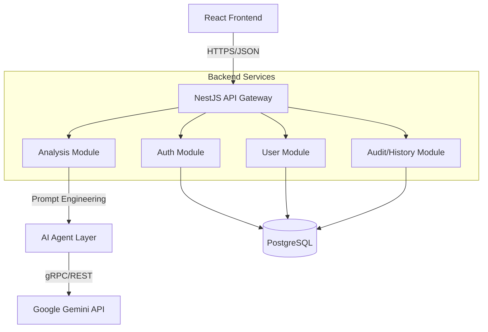

# ATLAS AI Incubator - Backend Implementation Plan

## 1. Executive Summary

Currently, the ATLAS AI Incubator operates as a client-side React application communicating directly with the Google Gemini API. To ensure security, scalability, and data persistence, we will migrate to a **Server-Client Architecture**.

The backend will serve as an **API Gateway** and **Data Layer**, handling authentication, rate limiting, prompt orchestration, and persistent storage of generation history.

## 2. Technology Stack

| Component          | Technology                                 | Justification                                                                                                                              |
| :----------------- | :----------------------------------------- | :----------------------------------------------------------------------------------------------------------------------------------------- |
| **Runtime**        | **Node.js** (v20 LTS)                      | Shared language (TypeScript) with frontend; high performance for I/O.                                                                      |
| **Framework**      | **NestJS**                                 | Provides a modular, scalable architecture (Dependency Injection, Decorators) fitting the "System Architecture" vision.                     |
| **Language**       | **TypeScript**                             | Type safety across the full stack.                                                                                                         |
| **Database**       | **PostgreSQL**                             | Relational integrity for user data + JSONB support for flexible AI analysis results.                                                       |
| **ORM**            | **Prisma**                                 | Type-safe database access and migration management.                                                                                        |
| **AI Integration** | **Google GenAI SDK**                       | Moved from frontend to backend to secure API keys.                                                                                         |
| **Authentication** | **Supabase Auth** or **Passport.js (JWT)** | We will use **JWT via Passport.js** to maintain control, or Supabase for speed. _Recommendation: JWT/Passport for custom role management._ |

## 3. System Architecture (Modular Monolith)

We will adopt a **Modular Monolith** approach. This mimics microservices isolation (Auth Module, Analysis Module, User Module) but runs in a single deployable unit to reduce DevOps complexity initially.



## 4. Database Schema (Prisma)

```prisma
model User {
  id        String   @id @default(uuid())
  email     String   @unique
  password  String   // Hashed
  fullName  String?
  role      Role     @default(USER) // USER, ADMIN
  createdAt DateTime @default(now())
  analyses  Analysis[]
}

model Analysis {
  id          String   @id @default(uuid())
  userId      String
  user        User     @relation(fields: [userId], references: [id])

  module      String   // e.g., 'strategy', 'finance'
  tool        String   // e.g., 'swot', 'budgetGenerator'

  inputDescription String @db.Text

  // The AI result stored as structured JSON
  resultData  Json

  version     Int      @default(1)
  isLatest    Boolean  @default(true)
  parentId    String?  // For version history (Audit Trail)

  createdAt   DateTime @default(now())
}

enum Role {
  USER
  ADMIN
}
```

## 5. API Endpoint Design

### Authentication

- `POST /auth/register`
- `POST /auth/login` (Returns JWT Access Token + Refresh Token)
- `POST /auth/refresh`

### Analysis (The Core)

- `POST /analysis/generate`
  - **Body:** `{ tool: string, input: string, language: string }`
  - **Action:** Calls Gemini API with specific system instructions -> Validates JSON -> Saves to DB -> Returns Data.

### History & Audit

- `GET /history` (Paginated list of user's past generations)
- `GET /history/:id` (Specific record details)
- `POST /history/:id/version` (Fork/Save new version of an analysis)

### Resources (Future Proofing)

- `GET /integrations/connect` (OAuth flows for GA/Meta)

## 6. Migration Steps

### Step 1: Scaffold Backend

1. Initialize NestJS project.
2. Configure Docker Compose for local PostgreSQL.
3. Setup Prisma and apply initial schema.

### Step 2: Port AI Logic

1. Move `geminiService.ts` logic from Frontend to Backend.
2. Create the `AnalysisService` in NestJS.
3. Secure `API_KEY` in backend environment variables.

### Step 3: Frontend Refactor

1. Replace direct calls in `App.tsx` with calls to the new API endpoints (`axios` or `fetch`).
2. Implement `AuthProvider` (React Context) to handle JWT storage and route protection.

### Step 4: Deployment

1. **Database:** Managed PostgreSQL (e.g., Supabase, AWS RDS, or Neon).
2. **Backend:** Render, Railway, or AWS Elastic Beanstalk.
3. **Frontend:** Vercel or Netlify (updated build settings).

## 7. Security Improvements

1. **API Key Hiding:** The Gemini Key never touches the browser.
2. **Rate Limiting:** Implement `ThrottlerModule` in NestJS to prevent abuse (e.g., 10 requests/minute per user).
3. **Input Validation:** Use `class-validator` (DTOs) to sanitize business descriptions before sending to AI.
